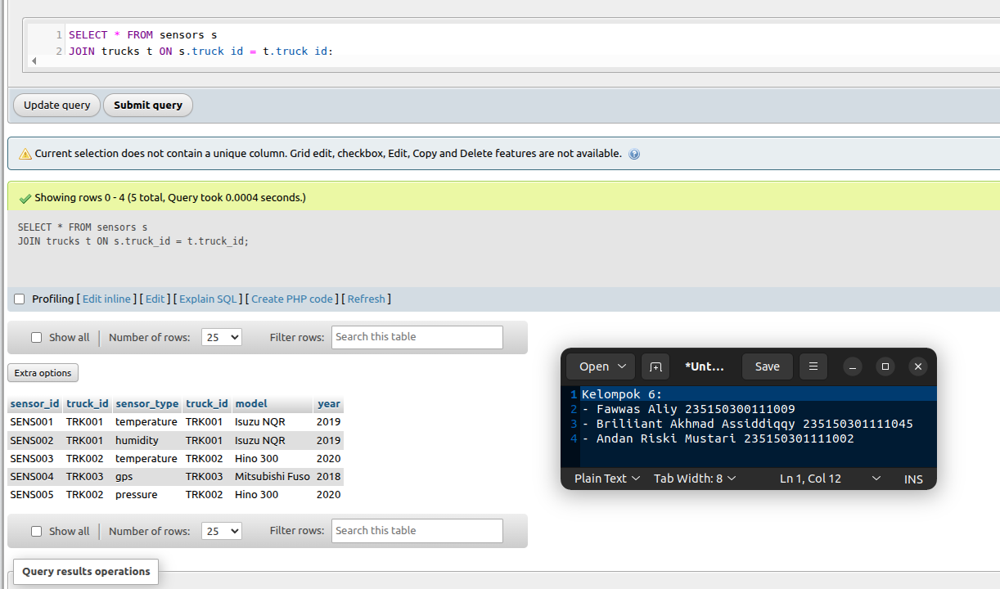
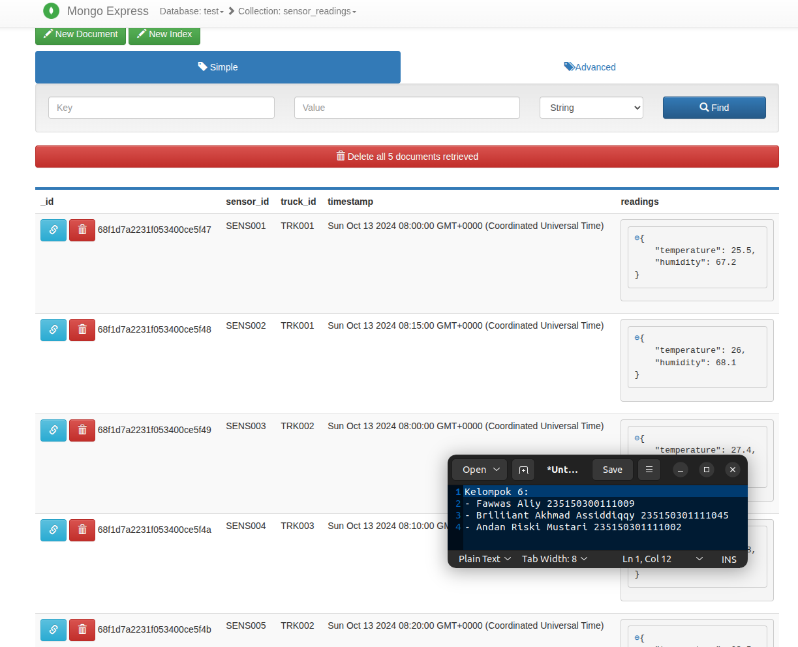
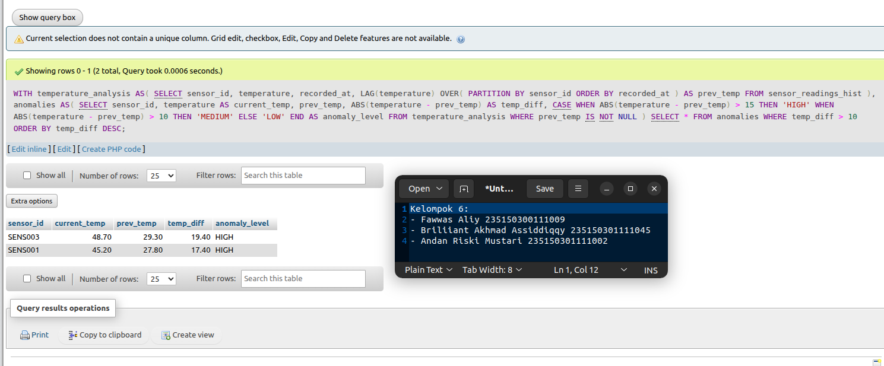

# Kelompok 6
- Fawwas Aliy 235150300111009
- Briliiant Akhmad Assiddiqqy 235150301111045
- Andan Riski Mustari 235150301111002

Sumber/Repo: [github.com/FechL/pid-uts-praktik-etl](https://github.com/FechL/pid-uts-praktik-etl)

# Soal 1: Batch Processing
Membuat batch pipeline menggunakan Python dan Pandas untuk memproses data sensor_data_raw.csv. Tugasnya meliputi pembersihan data (mengisi suhu kosong dengan median), menghitung rata-rata suhu serta kelembapan maksimum per truk, dan menyimpan hasil ke file CSV. Soal ini menilai kemampuan dasar pemrosesan data terprogram.

## Preparation
Impor library pandas untuk menampung dataset.
```py
import pandas as pd
```

## Function
Terdapat 2 function untuk cleaning data (missing values) dan menghitung agregasi.
```py
def clean_sensor_data(df):
    df.fillna(df.median(numeric_only=True), inplace=True)
    return df

def calculate_aggregates(df):
    agregasi_df = df.groupby('truck_id').agg(
        avg_temp=('temperature_kelvin', 'mean'),
        max_humidity=('humidity_percent', 'max'),
    ).round(2).reset_index()
    return agregasi_df
```

## Main
Load dataset dari datasets/sensor_data_raw.csv dan menamiplkan informasi dari data tersebut.
```py
df = pd.read_csv('datasets/sensor_data_raw.csv')
df.info()
```
```
<class 'pandas.core.frame.DataFrame'>
RangeIndex: 45 entries, 0 to 44
Data columns (total 8 columns):
 #   Column              Non-Null Count  Dtype  
---  ------              --------------  -----  
 0   truck_id            45 non-null     object 
 1   sensor_id           45 non-null     object 
 2   timestamp           45 non-null     object 
 3   temperature_kelvin  44 non-null     float64
 4   humidity_percent    44 non-null     float64
 5   gps_lat             45 non-null     float64
 6   gps_lng             45 non-null     float64
 7   engine_status       45 non-null     object 
dtypes: float64(4), object(4)
memory usage: 2.9+ KB
```
Terlihat bahwa pada kolom temperature_kelvin dan humidity_percent terdapat data yang tidak komplit atau missing.
Data missing tersebut diimputasi menggunakan median.
```py
cleaned_df = clean_sensor_data(df)
df.info()
```
```
<class 'pandas.core.frame.DataFrame'>
RangeIndex: 45 entries, 0 to 44
Data columns (total 8 columns):
 #   Column              Non-Null Count  Dtype  
---  ------              --------------  -----  
 0   truck_id            45 non-null     object 
 1   sensor_id           45 non-null     object 
 2   timestamp           45 non-null     object 
 3   temperature_kelvin  45 non-null     float64
 4   humidity_percent    45 non-null     float64
 5   gps_lat             45 non-null     float64
 6   gps_lng             45 non-null     float64
 7   engine_status       45 non-null     object 
dtypes: float64(4), object(4)
memory usage: 2.9+ KB
```
Setelah cleaning data, dataset sudah tidak ada missing value.
Kemudian kita mengagregasi dataset tersebut per truck_id dan menghitung average temp dan max kelembapan setiap truck_id.
```py
result_df = calculate_aggregates(cleaned_df)
print(result_df)
```
```
  truck_id  avg_temp  max_humidity
0   TRK001    301.57          69.8
1   TRK002    298.52          70.2
2   TRK003    304.65          77.8
3   TRK004    298.93          67.5
4   TRK005    301.42          73.1
5   TRK006    298.12          64.9
6   TRK007    300.52          68.5
7   TRK008    297.02          63.4
8   TRK009    301.72          71.8
9   TRK010    299.22          66.9
```
Simpan hasil agregasi tersebut ke datasets/aggregated_results.csv
```py
result_df.to_csv('datasets/aggregated_results.csv', index=False)
```

# Soal 2: Database Implementation
Menguji implementasi database di MySQL dan MongoDB. Mahasiswa harus membuat tabel trucks dan sensors di MySQL dengan query JOIN, lalu mendesain koleksi sensor_readings di MongoDB serta menulis query pencarian dan agregasi. Fokus utamanya adalah penerapan konsep relasional dan non-relasional.

## Bagian A: MySQL Implementation
```sql
-- 1. Membuat tabel trucks
CREATE TABLE IF NOT EXISTS trucks (
    truck_id VARCHAR(10) PRIMARY KEY,
    model VARCHAR(50),
    year INT
);

-- 2. Membuat tabel sensors dengan relasi ke trucks
CREATE TABLE IF NOT EXISTS sensors (
    sensor_id VARCHAR(10) PRIMARY KEY,
    truck_id VARCHAR(10),
    sensor_type VARCHAR(20),
    FOREIGN KEY (truck_id) REFERENCES trucks(truck_id)
);

-- 3. Insert sample data (3 trucks, 5 sensors)
INSERT INTO trucks (truck_id, model, year) VALUES
('TRK001', 'Isuzu NQR', 2019),
('TRK002', 'Hino 300', 2020),
('TRK003', 'Mitsubishi Fuso', 2018);

INSERT INTO sensors (sensor_id, truck_id, sensor_type) VALUES
('SENS001', 'TRK001', 'temperature'),
('SENS002', 'TRK001', 'humidity'),
('SENS003', 'TRK002', 'temperature'),
('SENS004', 'TRK003', 'gps'),
('SENS005', 'TRK002', 'pressure');

-- 4. Query untuk menampilkan semua sensors dengan informasi truck
SELECT
  s.sensor_id,
  s.sensor_type,
  t.truck_id,
  t.model,
  t.year
FROM sensors s
JOIN trucks t ON s.truck_id = t.truck_id
ORDER BY t.truck_id, s.sensor_id;
```
Berikut screenshot implementasi query:


## Bagian B: MongoDB Document Design
```js
// 1. Contoh struktur dokumen sensor_readings
db.sensor_readings.insertMany([
    {
        "sensor_id": "SENS001",
        "truck_id": "TRK001",
        "timestamp": ISODate("2024-10-13T08:00:00Z"),
        "readings": {
            "temperature": 25.5,
            "humidity": 67.2
        }
    },
    {
        "sensor_id": "SENS002",
        "truck_id": "TRK001",
        "timestamp": ISODate("2024-10-13T08:15:00Z"),
        "readings": {
            "temperature": 26.0,
            "humidity": 68.1
        }
    },
    {
        "sensor_id": "SENS003",
        "truck_id": "TRK002",
        "timestamp": ISODate("2024-10-13T08:00:00Z"),
        "readings": {
            "temperature": 27.4,
            "humidity": 64.5
        }
    },
    {
        "sensor_id": "SENS004",
        "truck_id": "TRK003",
        "timestamp": ISODate("2024-10-13T08:10:00Z"),
        "readings": {
            "temperature": 23.8,
            "humidity": 70.2
        }
    },
    {
        "sensor_id": "SENS005",
        "truck_id": "TRK002",
        "timestamp": ISODate("2024-10-13T08:20:00Z"),
        "readings": {
            "temperature": 28.5,
            "humidity": 62.0
        }
    }
]);

// 2. Query untuk menampilkan semua readings dari truck tertentu (misal TRK001)
db.sensor_readings.find({ truck_id: "TRK001" });

// 3. (Opsional) Query untuk menampilkan sensor dengan suhu di atas 26°C
db.sensor_readings.find({ "readings.temperature": { $gt: 26 } });
```
Berikut screenshot implementasi:


# Soal 3: Advanced SQL dengan Window Functions
mMnggunakan fungsi window SQL seperti ROW_NUMBER(), AVG() OVER, LAG(), dan RANK() untuk menganalisis data sensor. Hasilnya menampilkan urutan pembacaan, rata-rata suhu per truk, selisih suhu antarwaktu, dan peringkat suhu tertinggi. Soal ini menilai kemampuan analisis data SQL tingkat lanjut.
```sql
WITH temperature_analysis AS (
  SELECT 
    sensor_id,
    temperature,
    recorded_at,
    LAG(temperature) OVER (
      PARTITION BY sensor_id 
      ORDER BY recorded_at
    ) AS prev_temp
  FROM sensor_readings_hist
),
anomalies AS (
  SELECT 
    sensor_id,
    temperature AS current_temp,
    prev_temp,
    ABS(temperature - prev_temp) AS temp_diff,
    CASE
      WHEN ABS(temperature - prev_temp) > 15 THEN 'HIGH'
      WHEN ABS(temperature - prev_temp) > 10 THEN 'MEDIUM'
      ELSE 'LOW'
    END AS anomaly_level
  FROM temperature_analysis
  WHERE prev_temp IS NOT NULL
)
SELECT * 
FROM anomalies
WHERE temp_diff > 10
ORDER BY temp_diff DESC;
```
Berikut screenshot implementasi query:


# Soal 4: Simple ETL Pipeline
Membangun pipeline ETL sederhana dari JSON ke CSV. Prosesnya mencakup extract dan flatten data JSON, transform dengan konversi suhu ke Fahrenheit serta perhitungan comfort index, lalu load hasil ke file CSV. Soal ini menilai pemahaman alur pemrosesan data mentah.

## Preparation
Impor library yang dibutuhkan yaitu pandas untuk mengelola data dan json untuk membaca data json.
```py
import pandas as pd
import json
```

## Function
Fungsi berupa Extract, Transform, dan Load.
```py
def extract_json_data(file_path):
    # baca file sensor
    with open(file_path, "r") as f:
        data = json.load(f)
    
    # baca nested array
    rows = []
    for sensor in data:
        sensor_id = sensor["sensor_id"]
        truck_id = sensor["truck_id"]
        for reading in sensor["readings"]:
            rows.append({
                "sensor_id": sensor_id,
                "truck_id": truck_id,
                "timestamp": reading["timestamp"],
                "temp": reading["temp"],
                "humidity": reading["humidity"]
            })

    df = pd.DataFrame(rows)
    return df

def transform_data(df):
    # ubah celsius ke fahrenheit
    df["temp"] = df["temp"] * 9/5 + 32

    # kalkulasi comfort index
    df["comfort_index"] = (df["temp"] / df["humidity"]) * 100
    df = df.round({"temp": 2, "comfort_index": 2})
    
    return df

def load_to_csv(df, output_path):
    # simpan ke path output
    df.to_csv(output_path, index=False)
    print(f"Data berhasil disimpan ke {output_path}")
```

## Main
Ambil raw data pada datasets/sensors_2024-10-13.json dan extract data tersebut.
```py
raw_data = extract_json_data('datasets/sensors_2024-10-13.json')
print(raw_data.head())
```
```
  sensor_id truck_id             timestamp  temp  humidity
0   SENS001   TRK001  2024-10-13T08:00:00Z  25.0      65.0
1   SENS001   TRK001  2024-10-13T08:15:00Z  28.1      67.0
2   SENS001   TRK001  2024-10-13T08:30:00Z  26.7      66.0
3   SENS002   TRK002  2024-10-13T08:00:00Z   NaN      70.0
4   SENS002   TRK002  2024-10-13T08:15:00Z  22.3       NaN
```
Setelah di extract, beberapa parameter di transform terlebih dahulu.
```py
transformed_data = transform_data(raw_data)
print(transformed_data.head())
```
```
  sensor_id truck_id             timestamp   temp  humidity  comfort_index
0   SENS001   TRK001  2024-10-13T08:00:00Z  77.00      65.0         118.46
1   SENS001   TRK001  2024-10-13T08:15:00Z  82.58      67.0         123.25
2   SENS001   TRK001  2024-10-13T08:30:00Z  80.06      66.0         121.30
3   SENS002   TRK002  2024-10-13T08:00:00Z    NaN      70.0            NaN
4   SENS002   TRK002  2024-10-13T08:15:00Z  72.14       NaN            NaN
```
Setelah itu output disimpan ke csv.
```py
load_to_csv(transformed_data, 'etl_oupt.csv')
```
Data berhasil disimpan ke etl_oupt.csv

# Soal 5: Data Quality Validation
Mengembangkan class DataQualityChecker untuk mendeteksi missing values, nilai di luar rentang wajar, dan data duplikat pada dataset sensor. Hasil pemeriksaan ditampilkan dalam laporan ringkas. Soal ini menguji kemampuan validasi dan penjaminan kualitas data sebelum analisis.

## Preparation
Impor library pandas untuk pengeloalaan data.
```py
import pandas as pd
```
Sampel data dengan beberapa maasalah kualitas dan data yang bersih.
```py
test_data_kotor = pd.DataFrame([
    {"sensor_id": "SENS001", "truck_id": "TRK001", "temp": -999, "humidity": 120},  # Invalid values
    {"sensor_id": "SENS002", "truck_id": "", "temp": 25.5, "humidity": None},       # Missing values  
    {"sensor_id": "SENS001", "truck_id": "TRK001", "temp": 25.5, "humidity": 65},   # Duplicate
    {"sensor_id": "SENS001", "truck_id": "TRK001", "temp": 25.5, "humidity": 65}    # Duplicate
])

test_data_bersih = pd.DataFrame([
    {"sensor_id": "SENS001", "truck_id": "TRK001", "temp": 25.5, "humidity": 65},
    {"sensor_id": "SENS002", "truck_id": "TRK002", "temp": 27.0, "humidity": 60},
    {"sensor_id": "SENS003", "truck_id": "TRK003", "temp": 22.3, "humidity": 70},
    {"sensor_id": "SENS004", "truck_id": "TRK004", "temp": 30.1, "humidity": 55}
])
```
## Class Function
Berisikan beberapa function atau method untuk mengecek kualitas data.
```py
class DataQualityChecker:
    def __init__(self):
        self.violations = []

    def check_missing_values(self, df, required_columns):
        # Mengecek nilai yang hilang di kolom yang diperlukan
        for col in required_columns:
            missing = df[col].isnull().sum() + (df[col] == "").sum()
            if missing > 0:
                self.violations.append(f"Data hilang ditemukan di kolom '{col}': {missing} baris")

    def check_value_ranges(self, df):
        # Mengecek nilai yang tidak valid di kolom temp dan humidity
        invalid_temp = df[(df["temp"] < -40) | (df["temp"] > 80)]
        if not invalid_temp.empty:
            self.violations.append(f"Nilai temperature tidak valid: {len(invalid_temp)} baris")

        invalid_hum = df[(df["humidity"] < 0) | (df["humidity"] > 100) | (df["humidity"].isnull())]
        if not invalid_hum.empty:
            self.violations.append(f"Nilai humidity tidak valid: {len(invalid_hum)} baris")

    def check_duplicates(self, df, key_columns):
        # Mengecek duplikat berdasarkan argumen kolom
        duplicates = df[df.duplicated(subset=key_columns, keep=False)]
        if not duplicates.empty:
            self.violations.append(f"Duplikasi data ditemukan: {len(duplicates)} baris")

    def generate_report(self):
        # Menghasilkan laporan kualitas data
        if not self.violations:
            return "Tidak ada kesalahan kualitas data ditemukan. Data sudah bersih."
        report = "Terdapat kesalah data.\nData kualitas report:\n"
        for v in self.violations:
            report += f"- {v}\n"
        return report
```

## Main
Testing data kotor.
```py
checker1 = DataQualityChecker()
checker1.check_missing_values(test_data_kotor, ['sensor_id', 'truck_id'])
checker1.check_value_ranges(test_data_kotor)
checker1.check_duplicates(test_data_kotor, ['sensor_id', 'truck_id'])
report = checker1.generate_report()
print(report)
```
```
Terdapat kesalah data.
Data kualitas report:
- Data hilang ditemukan di kolom 'truck_id': 1 baris
- Nilai temperature tidak valid: 1 baris
- Nilai humidity tidak valid: 2 baris
- Duplikasi data ditemukan: 3 baris

```
Testing data bersih.
```py
checker2 = DataQualityChecker()
checker2.check_missing_values(test_data_bersih, ['sensor_id', 'truck_id'])
checker2.check_value_ranges(test_data_bersih)
checker2.check_duplicates(test_data_bersih, ['sensor_id', 'truck_id'])
report = checker2.generate_report()
print(report)
```
```
Tidak ada kesalahan kualitas data ditemukan. Data sudah bersih.
```

# Kesimpulan
Kelima soal UTS Arsitektur Sistem Data membentuk pemahaman utuh tentang pengelolaan data dari akuisisi hingga validasi. Soal pertama melatih pembersihan dan agregasi data dengan Python, soal kedua mengenalkan implementasi MySQL dan MongoDB, soal ketiga menerapkan analisis anomali dengan SQL Window Functions, soal keempat membangun pipeline ETL sederhana, dan soal kelima menekankan pentingnya validasi kualitas data. Secara keseluruhan, rangkaian soal ini menggambarkan alur kerja arsitektur data modern secara terintegrasi dan praktis.